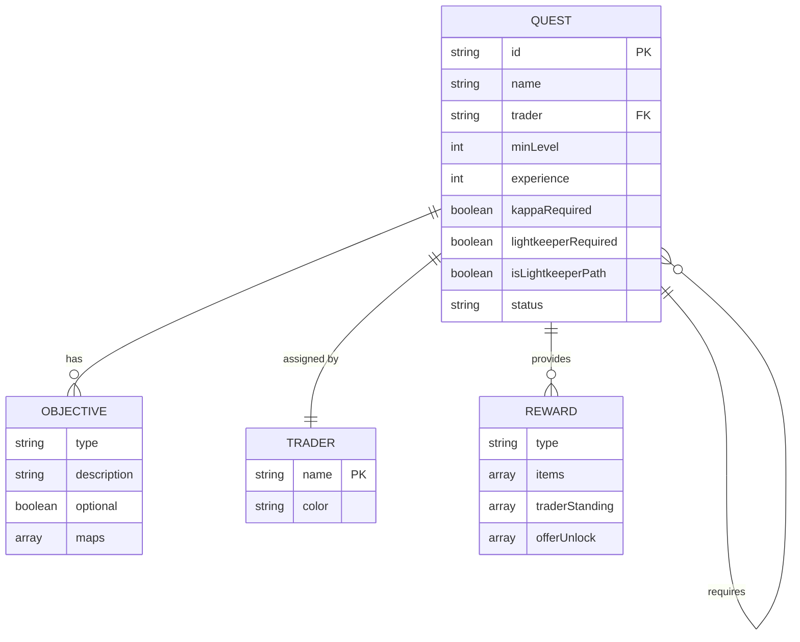

# Data Model: Tarkov Quest Tracker

**Branch**: `master` | **Date**: 2025-11-15  
**Purpose**: Define all data structures and their relationships

## Entity Overview



---

## Core Entities

### 1. Quest

**Description**: Represents a single quest/task in Escape from Tarkov

**Source**: Tarkov.dev GraphQL API (tasks)

**Structure**:
```typescript
interface Quest {
  // Identity
  id: string                    // Unique identifier (e.g., "5936d90786f7742b1420ba5b")
  name: string                  // Display name (e.g., "Debut")
  
  // Classification
  trader: string                // Trader name (e.g., "Prapor", "Therapist")
  minLevel: number              // Minimum player level required (1-79)
  
  // Dependencies
  prerequisites: string[]       // Array of quest IDs that must be completed first
  
  // Content
  objectives: QuestObjective[]  // List of objectives to complete
  
  // Rewards
  experience: number            // XP reward on completion
  rewards: {
    start: RewardSet            // Rewards given when accepting quest
    finish: RewardSet           // Rewards given on quest completion
  }
  
  // Special Flags
  kappaRequired: boolean        // Required for Kappa container
  lightkeeperRequired: boolean  // Required for Lightkeeper unlock
  isLightkeeperPath: boolean    // Computed: in Lightkeeper quest chain
  
  // UI State (transient, not persisted)
  status?: 'completed' | 'available' | 'locked'  // Computed from user progress
  visible?: boolean             // Computed from filters
}
```

**Validation Rules**:
- `id`: Non-empty string, unique across all quests
- `name`: Non-empty string
- `trader`: Must be valid trader name
- `minLevel`: Integer between 1 and 79
- `prerequisites`: Array of valid quest IDs (may be empty)
- `objectives`: Non-empty array
- `experience`: Non-negative integer

**Status Computation**:
```javascript
function computeStatus(quest, completedIds, playerLevel) {
  if (completedIds.has(quest.id)) {
    return 'completed';
  }
  
  const prereqsMet = quest.prerequisites.every(id => completedIds.has(id));
  const levelMet = playerLevel >= quest.minLevel;
  
  if (prereqsMet && levelMet) {
    return 'available';
  }
  
  return 'locked';
}
```

**Example**:
```json
{
  "id": "5936d90786f7742b1420ba5b",
  "name": "Debut",
  "trader": "Prapor",
  "minLevel": 1,
  "prerequisites": [],
  "objectives": [
    {
      "type": "kill",
      "description": "Eliminate 5 Scavs on Customs",
      "optional": false,
      "maps": ["Customs"]
    }
  ],
  "experience": 800,
  "rewards": {
    "start": { "items": [], "traderStanding": [] },
    "finish": {
      "items": [
        { "name": "MP-133 12ga shotgun", "count": 1, "iconLink": "..." }
      ],
      "traderStanding": [
        { "trader": "Prapor", "standing": 0.01 }
      ]
    }
  },
  "kappaRequired": true,
  "lightkeeperRequired": false,
  "isLightkeeperPath": false,
  "status": "available"
}
```

---

### 2. QuestObjective

**Description**: A single objective within a quest

**Structure**:
```typescript
interface QuestObjective {
  type: string          // Objective category (kill, find, mark, collect, etc.)
  description: string   // Full objective text
  optional: boolean     // Whether objective is optional
  maps?: string[]       // Map names where objective can be completed
}
```

**Objective Types** (from API):
- `kill`: Eliminate specific enemies
- `find`: Locate items in raid
- `collect`: Bring items to trader
- `mark`: Mark locations or objects
- `place`: Place items in specific locations
- `extract`: Extract with specific conditions
- `skill`: Reach skill level
- `survive`: Survive raids with conditions

**Validation Rules**:
- `type`: Non-empty string
- `description`: Non-empty string
- `optional`: Boolean value
- `maps`: Array of valid map names (may be undefined)

**Example**:
```json
{
  "type": "find",
  "description": "Find the chemical container on Customs",
  "optional": false,
  "maps": ["Customs"]
}
```

---

### 3. RewardSet

**Description**: Collection of rewards (items, trader standing, unlocks)

**Structure**:
```typescript
interface RewardSet {
  items: RewardItem[]
  traderStanding: TraderStanding[]
  offerUnlock?: OfferUnlock[]
}
```

---

### 4. RewardItem

**Description**: Item reward with quantity

**Structure**:
```typescript
interface RewardItem {
  name: string        // Item display name
  count: number       // Quantity rewarded
  iconLink?: string   // URL to item icon (optional)
}
```

**Validation Rules**:
- `name`: Non-empty string
- `count`: Positive integer
- `iconLink`: Valid URL or undefined

**Example**:
```json
{
  "name": "Roler Submariner gold wrist watch",
  "count": 2,
  "iconLink": "https://assets.tarkov.dev/..."
}
```

---

### 5. TraderStanding

**Description**: Reputation change with a trader

**Structure**:
```typescript
interface TraderStanding {
  trader: string      // Trader name
  standing: number    // Standing change (positive or negative)
}
```

**Validation Rules**:
- `trader`: Valid trader name
- `standing`: Number (typically -0.05 to +0.1)

**Example**:
```json
{
  "trader": "Prapor",
  "standing": 0.03
}
```

---

### 6. OfferUnlock

**Description**: Item that becomes available for purchase from trader

**Structure**:
```typescript
interface OfferUnlock {
  item: string        // Item name
  trader: string      // Trader offering the item
}
```

**Example**:
```json
{
  "item": "M4A1 5.56x45 assault rifle",
  "trader": "Peacekeeper"
}
```

---

### 7. Trader

**Description**: NPC quest giver (reference data, not an entity)

**Traders**:
- Prapor
- Therapist
- Skier
- Peacekeeper
- Mechanic
- Ragman
- Jaeger
- Fence (minimal quests)
- Lightkeeper (special unlock)

**Color Mapping** (for UI):
```javascript
const TRADER_COLORS = {
  'Prapor': '#E74C3C',      // Red
  'Therapist': '#3498DB',   // Blue
  'Skier': '#9B59B6',       // Purple
  'Peacekeeper': '#1ABC9C', // Teal
  'Mechanic': '#F39C12',    // Orange
  'Ragman': '#95A5A6',      // Gray
  'Jaeger': '#27AE60',      // Green
  'Fence': '#34495E',       // Dark gray
  'Lightkeeper': '#F1C40F'  // Yellow
};
```

---

## State Management Entities

### 8. ProgressData

**Description**: User's quest completion progress (LocalStorage)

**Storage Key**: `tarkov_quest_progress`

**Structure**:
```typescript
interface ProgressData {
  version: string       // Data format version (e.g., "1.0")
  timestamp: number     // Last update timestamp (Date.now())
  completed: string[]   // Array of completed quest IDs
}
```

**Validation Rules**:
- `version`: Semantic version string
- `timestamp`: Valid Unix timestamp
- `completed`: Array of valid quest IDs

**Example**:
```json
{
  "version": "1.0",
  "timestamp": 1700000000000,
  "completed": [
    "5936d90786f7742b1420ba5b",
    "59674cd986f7744ab26e32f2",
    "59674eb386f774539f14813a"
  ]
}
```

**Migration Strategy**:
```javascript
function migrateProgressData(stored) {
  if (!stored.version) {
    // v0 format: just array of IDs
    return {
      version: "1.0",
      timestamp: Date.now(),
      completed: Array.isArray(stored) ? stored : []
    };
  }
  
  // Future migrations here
  return stored;
}
```

---

### 9. CacheEntry

**Description**: Cached API response (LocalStorage)

**Storage Key**: `tarkov_quest_cache`

**Structure**:
```typescript
interface CacheEntry {
  version: string       // Data format version
  timestamp: number     // Cache creation time
  data: Quest[]         // Complete quest dataset
}
```

**Expiration**: 24 hours (86,400,000 ms)

**Validation**:
```javascript
function isCacheExpired(entry) {
  const age = Date.now() - entry.timestamp;
  return age > 24 * 60 * 60 * 1000; // 24 hours
}
```

**Example**:
```json
{
  "version": "1.0",
  "timestamp": 1700000000000,
  "data": [ /* array of Quest objects */ ]
}
```

---

## Computed Properties

### isLightkeeperPath

**Description**: Whether quest is in the Lightkeeper unlock chain

**Computation**:
```javascript
function computeLightkeeperPaths(quests) {
  const lightkeeperQuest = quests.find(q => q.name === "Lightkeeper");
  if (!lightkeeperQuest) return;
  
  const queue = [lightkeeperQuest.id];
  const visited = new Set();
  
  while (queue.length > 0) {
    const questId = queue.shift();
    if (visited.has(questId)) continue;
    
    visited.add(questId);
    const quest = quests.find(q => q.id === questId);
    
    quest.isLightkeeperPath = true;
    quest.prerequisites.forEach(prereqId => {
      if (!visited.has(prereqId)) {
        queue.push(prereqId);
      }
    });
  }
}
```

**Usage**: Visual highlighting in graph, special filtering

---

## Relationships

### Quest Prerequisites (Many-to-Many)

**Relationship**: Quest → Prerequisites → Quest

**Direction**: One-way (child knows parents, not vice versa)

**Implementation**:
```javascript
class QuestManager {
  getPrerequisites(questId) {
    const quest = this.getQuest(questId);
    return quest.prerequisites.map(id => this.getQuest(id));
  }
  
  getDependents(questId) {
    return this.quests.filter(q => 
      q.prerequisites.includes(questId)
    );
  }
}
```

**Graph Representation**:
- **Nodes**: Quests
- **Edges**: Prerequisites (directed)
- **Layout**: Dagre hierarchical (top-down)

---

## Data Transformations

### API Response → Internal Model

**Transformation**:
```javascript
function transformApiData(apiTasks) {
  return apiTasks.map(task => ({
    id: task.id,
    name: task.name,
    trader: task.trader.name,
    minLevel: task.minPlayerLevel,
    prerequisites: task.taskRequirements.map(req => req.task.id),
    objectives: task.objectives.map(obj => ({
      type: obj.type,
      description: obj.description,
      optional: obj.optional,
      maps: obj.maps?.map(m => m.name)
    })),
    experience: task.experience,
    rewards: {
      start: transformRewards(task.startRewards),
      finish: transformRewards(task.finishRewards)
    },
    kappaRequired: task.kappaRequired,
    lightkeeperRequired: task.lightkeeperRequired,
    isLightkeeperPath: false  // Computed after all loaded
  }));
}

function transformRewards(apiRewards) {
  return {
    items: apiRewards.items?.map(item => ({
      name: item.item.name,
      count: item.count,
      iconLink: item.item.iconLink
    })) || [],
    traderStanding: apiRewards.traderStanding?.map(ts => ({
      trader: ts.trader.name,
      standing: ts.standing
    })) || [],
    offerUnlock: apiRewards.offerUnlock?.map(offer => ({
      item: offer.item.name,
      trader: offer.trader.name
    })) || []
  };
}
```

---

## Statistics Model

**Computed Statistics**:
```typescript
interface QuestStats {
  total: number                      // Total quests
  completed: number                  // Completed count
  available: number                  // Available at current level
  locked: number                     // Locked (prerequisites or level)
  byTrader: Map<string, TraderStats> // Per-trader breakdown
}

interface TraderStats {
  total: number       // Total quests for trader
  completed: number   // Completed for trader
  available: number   // Available for trader
  locked: number      // Locked for trader
}
```

**Computation**:
```javascript
function computeStats(quests, playerLevel) {
  const stats = {
    total: quests.length,
    completed: 0,
    available: 0,
    locked: 0,
    byTrader: new Map()
  };
  
  quests.forEach(quest => {
    // Update totals
    if (quest.status === 'completed') stats.completed++;
    else if (quest.status === 'available') stats.available++;
    else stats.locked++;
    
    // Update trader stats
    if (!stats.byTrader.has(quest.trader)) {
      stats.byTrader.set(quest.trader, {
        total: 0, completed: 0, available: 0, locked: 0
      });
    }
    
    const traderStats = stats.byTrader.get(quest.trader);
    traderStats.total++;
    traderStats[quest.status]++;
  });
  
  return stats;
}
```

---

## Invariants & Constraints

### Data Integrity Rules

1. **No Circular Dependencies**: Quest prerequisite graph must be acyclic (DAG)
2. **Valid References**: All prerequisite IDs must reference existing quests
3. **Consistent Status**: Quest status must match completion state and prerequisites
4. **Level Monotonicity**: Prerequisites should not have higher level requirements than dependents (not enforced, but expected)

### Validation

```javascript
function validateQuestData(quests) {
  const errors = [];
  const questIds = new Set(quests.map(q => q.id));
  
  quests.forEach(quest => {
    // Check valid prerequisites
    quest.prerequisites.forEach(prereqId => {
      if (!questIds.has(prereqId)) {
        errors.push(`Quest ${quest.name} references invalid prerequisite: ${prereqId}`);
      }
    });
    
    // Check for self-reference
    if (quest.prerequisites.includes(quest.id)) {
      errors.push(`Quest ${quest.name} references itself as prerequisite`);
    }
  });
  
  // Check for cycles (DFS)
  const hasCycle = detectCycle(quests);
  if (hasCycle) {
    errors.push('Quest dependency graph contains cycles');
  }
  
  return errors;
}
```

---

## Storage Quotas

**LocalStorage Limits**:
- **Total Capacity**: ~5-10MB per domain (browser dependent)
- **Quest Cache**: ~500KB (200 quests with all data)
- **Progress Data**: ~10KB (max 200 completed quest IDs)
- **Headroom**: ~90% capacity remaining for future features

**Monitoring**:
```javascript
function getStorageUsage() {
  let total = 0;
  for (let key in localStorage) {
    if (localStorage.hasOwnProperty(key)) {
      total += localStorage[key].length + key.length;
    }
  }
  return {
    used: total,
    usedKB: (total / 1024).toFixed(2),
    percentOfLimit: ((total / (5 * 1024 * 1024)) * 100).toFixed(2)
  };
}
```

---

## Future Extensions

### Potential Schema Changes

1. **Quest Notes**: User-added notes per quest
   ```typescript
   interface Quest {
     // ... existing fields
     userNotes?: string
   }
   ```

2. **Quest Timing**: Track completion times
   ```typescript
   interface ProgressData {
     // ... existing fields
     completedAt: Map<string, number>  // questId → timestamp
   }
   ```

3. **Multiple Profiles**: Support for multiple characters
   ```typescript
   interface ProgressData {
     // ... existing fields
     profiles: Map<string, ProfileData>
     activeProfile: string
   }
   ```

4. **Custom Quest Lists**: User-created quest collections
   ```typescript
   interface CustomList {
     id: string
     name: string
     description: string
     questIds: string[]
   }
   ```

---

**Next Steps**: Proceed to API contracts definition
